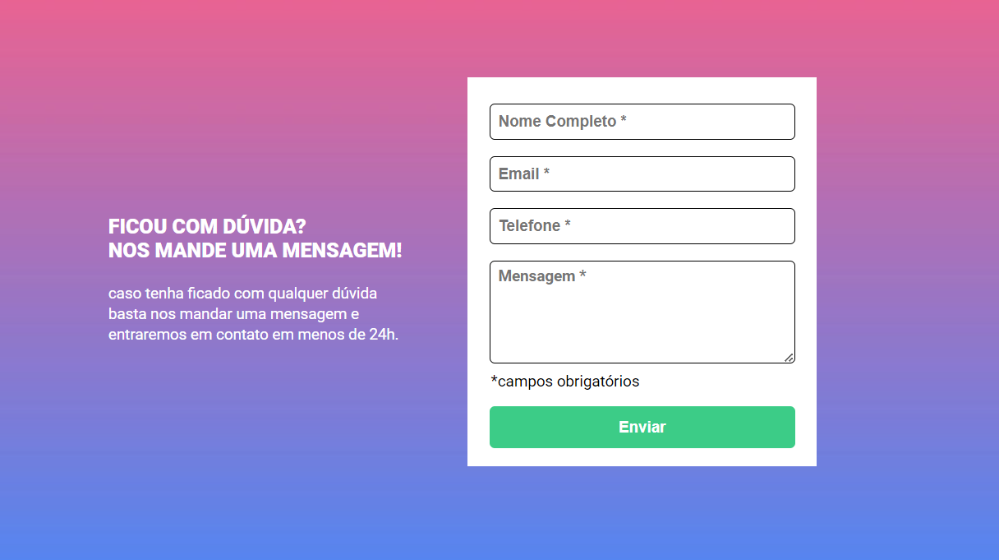
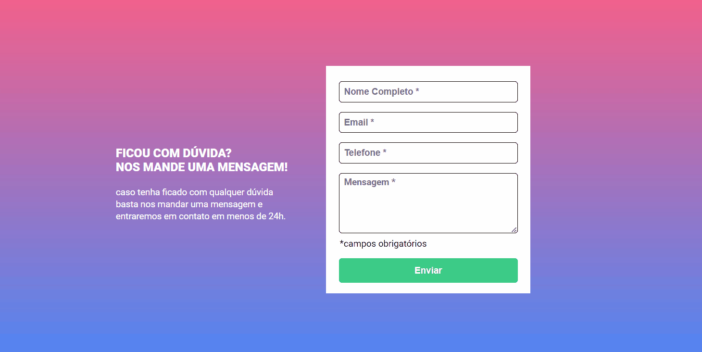
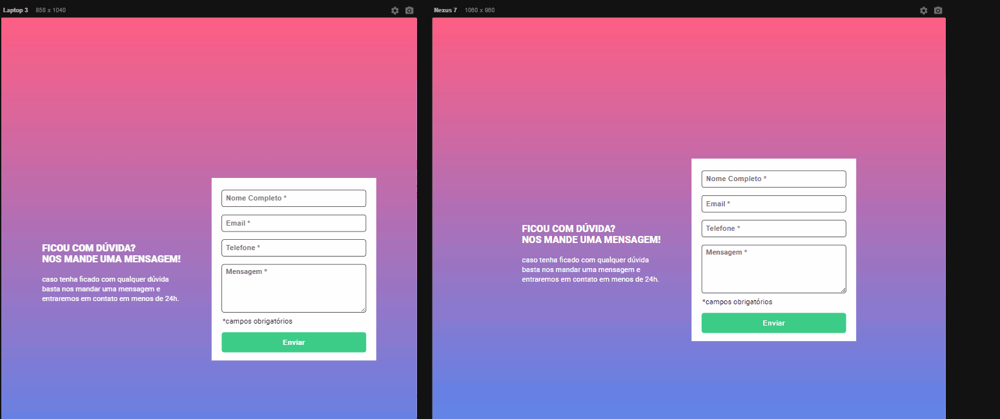

# Quest JavaScript Intermediário - Formulário 

Este é o projeto da quest de javascript intermediário de um formulário. 

[] 

## O Projeto

Um formulário com interação javascript, ao enviar o formulário os campos não preenchidos ficam com a borda em vermelho e aparece a mensagem "campo obrigatório", nos campos preenchidos a borda fica verde. O design do formulário também é responsivo.

[]

 []

### Linguagens utilizadas 

- HTML

- CSS

- JavaScript

